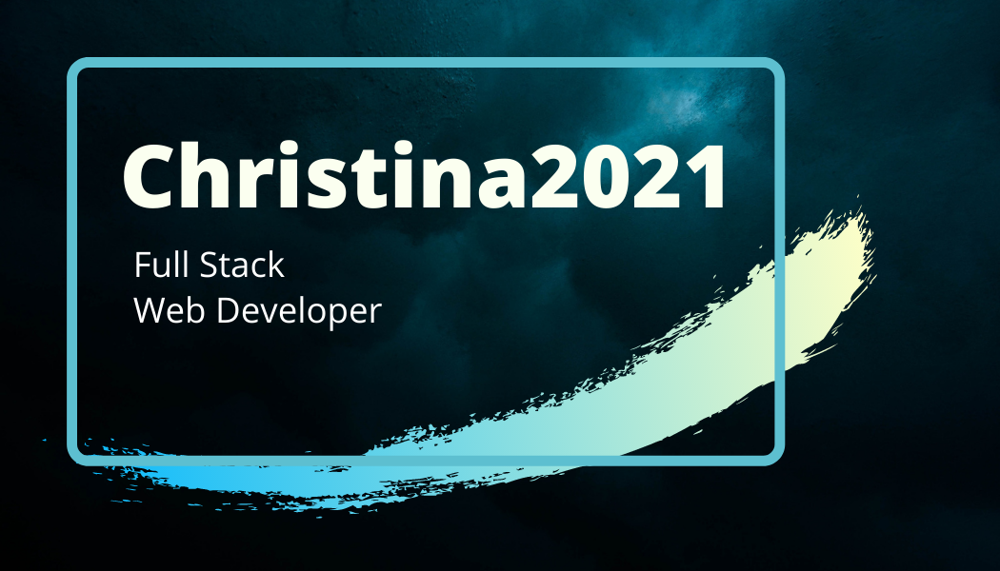

## Hello! My name is Christina! 😊

<!--
**Christina2021/Christina2021** is a ✨ _special_ ✨ repository because its `README.md` (this file) appears on your GitHub profile.

Here are some ideas to get you started:

- 🔭 I’m currently working on ...
- 🌱 I’m currently learning ...
- 👯 I’m looking to collaborate on ...
- 🤔 I’m looking for help with ...
- 💬 Ask me about ...
- 📫 How to reach me: ...
- 😄 Pronouns: ...
- ⚡ Fun fact: ...
-->

    <a href="https://christina2021.github.io/react-portfolio/#/">
    
    

I am a student enrolled in the University of California, San Diego Extension's Web Development Bootcamp.

### Below are the different technologies that I am familiar with:

Front-end Web Development: 
     

Back-end Web Development: 
   

Other: 

 

